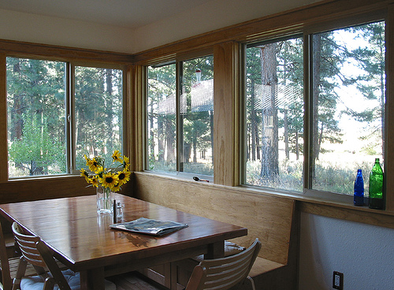

# An Efficient One-stage Prefix-based Generator for Image Captioning.

## Official implementation for the paper ["An Efficient One-stage Prefix-based Generator for Image Captioning"](https://arxiv.org/abs/2111.09734)


## Description  
In our work, we use the [X-VLM](https://github.com/zengyan-97/X-VLM) image encoder, which was already trained over an extremely large number of images-text pairs(4M), and GPT2 as the decoder, following the baselien [ClipCap](https://github.com/rmokady/CLIP_prefix_caption). 

## Examples

<table>
  <tr>
    <td></td>
    <td></td>
    <td></td>
  </tr>
  <tr>
    <td>a group of people standing next to an elephant. </td>
     <td>a wooden table with a vase of flowers on top of it.</td>
     <td>a wooden crate filled with lots of ripe and unripe bananas.</td>
  </tr>
 </table>
 
 <table>
  <tr>
    <td></td>
    <td></td>
    <td></td>
  </tr>
  <tr>
    <td>a woman is eating a bowl of food at a table. </td>
     <td>a wooden table topped with wooden spoons and wooden sticks.</td>
     <td>a motorcycle parked in a dirt field with horses in the background.</td>
  </tr>
 </table>


## Training prerequisites

Clone, create environment and install dependencies:  
```
git clone https://github.com/hyfwyy/OPG.git 
cd OPG
conda env create -f environment.yml
conda activate opg
```

## COCO training

Download [train_captions](https://drive.google.com/file/d/1D3EzUK1d1lNhD2hAvRiKPThidiVbP2K_/view?usp=sharing) to `data/coco/annotations`.

Download [training images](http://images.cocodataset.org/zips/train2014.zip) and [validation images](http://images.cocodataset.org/zips/val2014.zip) and unzip (We use Karpathy et el. split).

Download pre-trained 4M checkpoint from [X-VLM](https://github.com/zengyan-97/X-VLM).

For cross-entropy stage:

mlp+gpt2 tuning:
```
python train_scst.py --scst=False --device=cuda:0 --mapping_type=mlp --use_sparce_mask=True --use_aux_loss=True --threshold=0.1 --lamda=0.1
#
```
trans+gpt2 frozen:
```
python train_scst.py --scst=False --device=cuda:0 --mapping_type=transformer --only_prefix --use_sparce_mask=True --use_aux_loss=True --threshold=0.1 --lamda=0.1
```
trans+gpt2 tuning
```
python train_scst.py --scst=False --device=cuda:0 --mapping_type=transformer --only_prefix --use_sparce_mask=True --use_aux_loss=True --threshold=0.1 --lamda=0.1
```
For CIDEr optimization stage:
```
python train_scst.py --scst=True --checkpoint=$checkpoint_path$ --mapping_type=mlp 
```

<!-- ## Conceptual training

Download the .TSV train/val files from [Conceptual Captions](https://ai.google.com/research/ConceptualCaptions/download) and place them under <data_root> directory.

Download the images and extract CLIP features using (outputs are `<data_root>/conceptual_clip_ViT-B_32_train.pkl` and  `<data_root>/conceptual_clip_ViT-B_32_val.pkl`):
```
python parse_conceptual.py --clip_model_type ViT-B/32 --data_root <data_root> --num_threads 16
```
Notice, downloading the images might take a few days.

Train with fine-tuning of GPT2:
```
python train.py --data <data_root>/conceptual_clip_ViT-B_32_train.pkl --out_dir ./conceptual_train/
```
Similarly to the COCO training, you can train a transformer mapping network, and / or parse the images using a ResNet-based CLIP.  -->

<!-- ## Citation
If you use this code for your research, please cite:
```
@article{mokady2021clipcap,
  title={ClipCap: CLIP Prefix for Image Captioning},
  author={Mokady, Ron and Hertz, Amir and Bermano, Amit H},
  journal={arXiv preprint arXiv:2111.09734},
  year={2021}
} -->
<!-- ``` -->


# Acknowledgments
This repository is heavily based on [ClipCap](https://github.com/rmokady/CLIP_prefix_caption) repositories.
For training we used the data of [COCO dataset](https://cocodataset.org/#home).

## Contact
For any inquiry please contact us at our email addresses: hanyufeng0604@gmail.com


